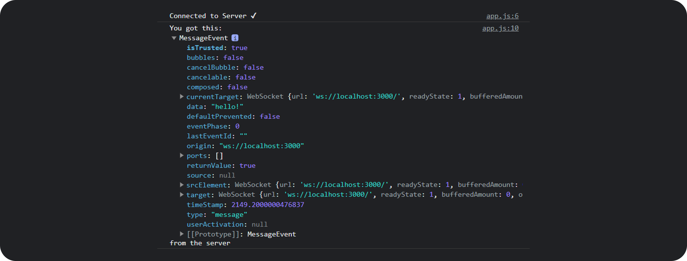
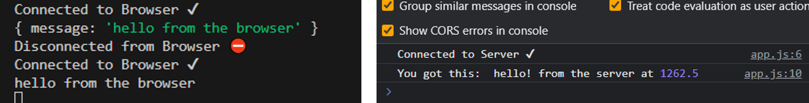
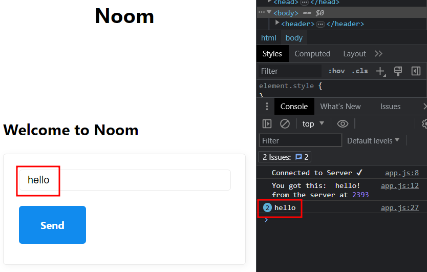
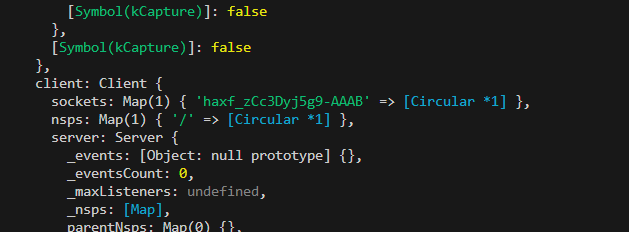

# Zoom Clone using NodeJS, WebRTC and Websockets
### from NomadCoders Zoom Clone Coding

## **목차**

- [기술들](#**기술들**)
- [1. Server Setup](#**1._Server_Setup**)
- [2. Frontend Setup](#**2._Frontend_Setup**)
- [3. WEBSOCKETS로 실시간 채팅 어플 만들기](#**3._WEBSOCKETS로_실시간_채팅_어플_만들기**)


### **기술들**
#### (1) Express

  Express는 Node.js를 위한 웹 이플리케이션 프레임워크이다. Express는 미들웨어(요청(request)과 응답(response) 사이에서 동작하는 함수)를 중심으로 동작하는데, 필요한 미들웨어를 조합하여 애플리케이션의 동작을 조정할 수 있다. Express는 다양한 HTTP 요청 메서드(GET, POST, PUT, DELETE 등)를 처리할 수 있으며, 요청 데이터의 처리, 파라미터 추출, 응답 생성 등을 간편하게 수행할 수 있다. 또한 URL과 해당하는 핸들러 함수를 연결하여 요청을 처리하는 라우팅 기능을 제공한다. 즉, 특정 URL에 대한 요청을 적절한 핸들러 함수로 전달하여 처리할 수 있다. 그리고 Express는 Pug, EJS, Handlebars 등 다양한 뷰 엔진과의 통합을 지원하여 템플릿 기반의 HTML을 생성하여 동적인 HTML 페이지를 생성할 수 있다.

#### (2) Pug

  Pug는 HTML 마크업을 생성하기 위한 템플릿 엔진 중 하나로, 동적인 웹 페이지나 웹 애플리케이션을 개발하는 경우에 유용하다. 들여쓰기로 요소 계층 구조를 표현할 때, 태그 이름과 속성을 축약된 방식으로 작성할 수 있다. 이를 통해 HTML 작성을 단순화하고, 중첩된 요소와 속성을 보다 명확하게 표현할 수 있다. 또한, Pug는 변수, 조건문, 반복문 등과 같은 프로그래밍적인 요소를 사용하여 동적인 컨텐츠를 생성할 수 있다.

  Pug는 Node.js를 기반으로 동작하며, Node.js 애플리케이션에서 서버 측 템플릿 엔진으로 사용된다. Pug 파일을 작성하고 이를 컴파일하여 HTML로 변환하면, 클라이언트에게 전송할 준비가 된 최종 HTML 문서를 얻을 수 있다.

#### (3) Nodemon

  nodemon은 Node.js 개발 환경에서 자동으로 애플리케이션을 감시하고 변경 사항이 있을 때 자동으로 재시작하는 도구이다. 개발 중인 Node.js 애플리케이션을 실행할 때, 파일의 변경을 감지하여 자동으로 서버를 다시 시작함으로써 생산성이 향상된다. 단, 프로젝트 디렉토리에서 0애플리케이션을 실행할 때 명령어로 node 대신 nodemon을 사용(`nodemon app.js`)해야 한다.

#### (4) Babel

  Babel은 최신 JavaScript 문법을 구 버전의 JavaScript로 변환하여 브라우저 호환성을 확보하거나, Node.js 환경에서 최신 기능을 사용할 수 있도록 해준다.

  <hr>


  ### **1. Server Setup**

  zoom 프로젝트 폴더에서 `npm init -y`로 Node.js 프로젝트를 위해 새로운 package.json 파일을 생성한다. package.json은 프로젝트의 설정 정보와 의존성 패키지들을 정의하는 파일이며, `-y` 옵션은 프로젝트 설정을 위한 대화형 인터페이스를 스킵하고 모든 설정에 기본값으로 자동으로 동의하여 바로 package.json을 생성한다.

  `npm i nodemon -D` 명령어로 Node.js 프로젝트에서 nodemon 패키지를 설치한다. nodemon 패키지가 설치되고 `package.json` 파일의 'devDependencides' 목록에 해당 패키지가 추가된다. 

  #### 현재 프로젝트 구조

  ```bash
  ├── .gitignore
  ├── nodemon.json
  ├── babel.config.json
  ├── src
  │   ├── server.js
  └── README.md
  ``` 

  `nodemon.json`는 nodemon 설정을, `babel.config.json` 파일은 Babel 설정을 포함하는 파일이다. `src/server.js` 파일은 서버 애플리케이션의 진입점 역할을 하는 파일로, 여기에서 서버를 설정하고 실행할 수 있다.

  #### babel 설치

  다음으로 babel을 설치한다. `npm i @babel/core @babel/cli @babel/node @babel/preset-env -D`명령어로 npm을 사용하여 Babel 관련 패키지들을 설치한다. 
    
  - @babel/core: Babel의 핵심 패키지로, Javascript 코드 변환을 처리한다.
  - @babel/cli: Babel CLI 도구로, 터미널에서 Babel을 실행할 수 있게 한다.
  - @babel/node: Babel을 사용해서 Node.js 애플리케이션을 실행할 수 있는 도구. Babel이 코드 변환을 수행하고, 변환된 코드를 실행한다. 
  - @babel/preset-env: Babel에서 환경에 맞게 자동으로 필요한 트랜스파일 설정을 결정하는 프리셋(preset)

  nodemon.js에서 다음 코드의 'exec' 옵션은 nodemon이 감시하는 파일이 변경될 때 실행할 명령을 지정하는 옵션이다.
  > {
  >  "exec": "babel-node src/server.js"
  > }
  즉, nodemon은 `src/server.js` 파일을 감시해서 파일이 변경될 때마다 Babel을 통해 해당 파일을 변환한 후 실행하도록 지정한다. 이를 통해 코드가 변경될 때마다 개발 서버를 자동으로 재시작할 수 있다. 

  또한, babel.config.json에서 다음 코드는 Babel이 제공하는 프리셋으로 최신 JavaScript 문법을 대상 환경에 맞게 자동으로 변환해주는 역할을 한다. 
  > {
  > "presets": ["@babel/preset-env"]
  > }

  package.json에는 다음 코드는 'dev'라는 사용자 정의 스크립트를 정의하고, 해당 스크립트가 'nodemon' 명령어를 실행하도록 설정한 것이다. 
  > "scripts": {"dev": "nodemon"},
  터미널에서 `npm run dev' 명령어를 실행하면 'nodemon' 명령이 실행되고, nodemon은 서버 파일을 실시간 감시하여 자동으로 서버를 재시작한다.

  마지막으로 `npm i express`로 express를, `npm i pug`로 pug를 설치한다.

  #### 웹 서버 동작 확인 
  src/server.js에서 다음 코드로 express 프레임워크를 사용하여 간단한 웹 서버가 잘 작동하는지 확인한다.
  ```javascript
  import express from "express"; // Es6의 모듈 시스템을 사용하여 'express' 모듈을 불러오기

  const app = express(); // express 함수를 호출하여 새로운 express 어플리케이션 객체 'app'을 생성

  console.log('hello!');

  app.listen(3000); // 'app' 객체의 listen 메서드를 호출하여 웹 서버를 시작 (3000번 포트에서 실행) 
  ```
  콘솔창에`npm run dev` 명령어를 실행하여 웹 서버가 잘 구동되는지 확인한다. (콘솔창에 hello! 확인)

  ### **2. Frontend Setup**

  다음으로, Express 애플리케이션의 뷰를 렌더링할 수 있도록 세팅한다. 

  #### 프로젝트 구조
  ```bash
  ├── .gitignore
  ├── nodemon.json
  ├── babel.config.json
  ├── src
  │   ├── server.js
  │   ├── views
  │         ├── home.pug
  │   ├── public
  │         ├── js
  │             ├── app.js    
  └── README.md
  ``` 

  src/server.js 의 아래 코드는 app 객체의 set 메서드를 사용하여 Express 애플리케이션에서 Pug 뷰 엔진을 설정하고, 뷰 파일의 경로를 지정한다. 
  ```JavaScript
  app.set("view engine", "pug");
  app.set("views", __dirname + "/views");

  ```
  `__dirname`은 현재 실행 중인 스크립트의 디렉토리 경로를 나타내는 Node.js의 내장 변수이다. 즉, 현재 스크립트가 위치한 디렉토리를 기준으로 "/views" 디렉토리를 지정한다. 위처럼 설정한 뷰 엔진과 뷰 파일 경로는 나중에 라우팅과 함께 사용되어 클라이언트에게 동적인 HTML 페이지를 제공하는 데 활용될 것이다.

  아래 코드는 '/public' 엔드포인트로 GET 요청이 들어왔을 때 해당 요청에 대해 'public' 디렉토리의 정적 파일을 제공하는 역할을 한다. 
  ```JavaScript
  app.use("/public", express.static(__dirname + "/public"));
  ```

  마찬가지로, 아래 코드는 루트 경로("/")에 대한 GET 요청이 들어올 때 'home'이라는 Pug 템플릿을 렌더링하여 클라이언트에게 제공하는 역할을 한다.
  ```JavaScript
  app.get("/", (req, res) => res.render("home"));
  ```

  또, server.js에서 Catch-all URL 을 설정해야 한다. Catch-all URL이란 경로에 상관없이 모든 요청을 핸들러 함수나 라우트로 보내는 역할을 한다. 예를 들어, 사용자가 존재하지 않는 경로에 접근했을 때 404 페이지를 보여줄 수 있다.
  > app.get("*", (req, res) => res.redirect("/"));

  위 코드는 Catch-all URL을 사용하여 모든 경로에 대한 GET 요청을 `/` 경로로 redirect하여 페이지를 다시 로드하도록 한다. 예를 들어, '/about', '/contact', '/products' 와 같이 현 시점에서 존재하지 않는 경로로 접근했을 때 모두 `/` 경로로 redirect 시켜준다. 

  다음으로, `nodemon.js`에 다음 코드를 추가한다. 
  > "ignore": ["src/public/*"],

  일반적으로 'src/public' 디렉토리에는 클라이언트에게 제공하기 위한 정적 파일이 포함된다. 이러한 파일은 개발 중에 빈번하게 수정된다. (가령 app.js는 FrontEnd에서 구동된다) 그래서 파일 변경 감지 및 자동 재시작 기능을 수행하는 nodemon에게 "src/public" 디렉토리 내부의 변경 사항을 무시하도록 명시함으로써, 불필요한 재시작을 방지하고 개발 서버의 성능을 향상시킬 수 있다.

  마지막으로, MVP CSS (Modular-View-Controller for CSS)를 적용할 것이다. MVP CSS는 CSS 코드를 관리하기 쉽고 재사용 가능한 모듈 단위로 분리하여 프론트엔드 개발에서 코드의 구조화와 유지 보수성을 향상시키는 데 도움이 되는 방법론이다. 다음 코드를 header에 추가하면 끝이다.
  > `link(rel="stylesheet", href="https://unpkg.com/mvp.css")`
  
  물론 CSS 작업을 추후에 별도로 할 것이지만, 초기 단계에서 아무런 꾸밈 없이 개발하는 것보다는 낫다. 


  ### **3. WEBSOCKETS로 실시간 채팅 어플 만들기**

  이 프로젝트에서 만들어 볼 실시간 채팅 어플리케이션은 익명으로 메시지를 보내고 받을 수 있으며, 사용자가 닉네임을 추가할 수 있도록 할 것이다. 사용자가 채팅방을 만들 수 있으며, 채팅방에 입장 및 퇴장하는 이벤트(예: 'oo님이 입장했습니다')도 추가할 것이다. 마지막으로, 채팅방에 현재 참여 중인 사용자 수를 확인하는 기능도 추가할 것이다.

  #### WebSocket 프로토콜 개념
  실시간 통신을 가능하게 해주는 것은 WebSocket 프로토콜 덕분이다. HTTP 프로토콜의 가장 큰 특징은 stateless이다. 따라서 real-time으로 request, response가 일어나지 않는다. 반면 WebSocket 프로토콜은 statefull 하기 때문에 HTTP와 다르게 지속적인 연결을 제공하며, 클라이언트와 서버 간 여러 데이터를 양방향으로 전송할 수 있다. HTTP는 클라이언트가 서버에 요청을 보내야만 서버에서 응답을 전송할 수 있다. 반면 WebSocket은 서버가 언제든 클라이언트에게 데이터를 푸쉬(push) 할 수 있으므로 실시간 업데이트가 가능하다. 또한 Websocket은 텍스트 기반인 HTTP 프로토콜과 다르게 이진(Binary) 형식으로 데이터를 주고받기 때문에 이미지, 오디오, 비디오 등과 같은 다양한 데이터 유형을 보다 효율적으로 전송할 수 있게 해준다. 

  브라우저가 서버로 WebSocket 요청을 보내면, 서버는 이 요청을 수락하거나 거절한다. 연결이 성립되면, 서버는 클라이언트를 기억하기 때문에 사용자에게 메시지를 보낼 수 있다. 한 번 연결된 후에는 마치 Wi-Fi처럼 계속해서 실시간 연결이 유지된다. 브라우저와 서버 간에는 실시간으로 계속된 연결이 이루어진다. 

  웹 브라우저는 내장된 WebSocket API가 있는데, 다양한 메서드를 통해 서버로 WebSocket 연결을 열고, 메시지를 보내고 받을 수 있으며, 연결 상태를 관리할 수 있다. 
  - `new WebSocket(url[, protocols])`: WebSocket 객체를 생성하고 서버와의 연결을 연다. 
  - `WebSocket.send(data)`: 서버로 메시지를 보낸다.
  - `WebSocket.close([code[, reason]])`: WebSocket 연결을 닫는다.

  #### ws 패키지
  WebSocket 서버를 Node.js로 만들기 위해 ws 패키지를 사용할 예정이다. 브라우저(클라이언트)에서는 이미 WebSocket API가 내장되어 있으므로, 프론트엔드 단에서는 별도의 설치가 필요하지 않다.
  
  터미널에서 `npm i ws` 명령어로 ws를 설치한다. ws 패키지는 WebSocket 프로토콜의 핵심 기능만을 제공하므로 채팅방과 같은 고급 기능을 직접 구현하기는 어렵다. 하지만 ws 패키지를 사용하는 프레임워크가 있는데, 이 프레임워크를 통해 앞으로 만든 모든 기능을 구현할 수 있다. 그전까지는 기본 기능을 테스트하고 WebSocket을 최대한 익히기 위해 ws 패키지만을 사용할 것이다. 

  다음으로, http와 websocket를 동일한 서버 포트에서 동시에 처리하기 위해 server.js 코드를 아래와 같이 수정한다.
  ```JavaScript
  ...
  import WebSocket from 'ws';
  import http from 'http';
  ...
  const server = http.createServer(app); // HTTP 서버 생성 (app은 Express 앱 객체)

  const wss = new WebSocket.Server({server}); // WebSocket.Server 클래스로 웹소켓 서버를 생성하고, 생성자에는 HTTP 서버 객체 server를 전달하여 웹소켓 서버가 HTTP 서버 위에서 동작하도록 함.

  server.listen(3000, handleListen); // HTTP 서버를 3000번 포트에서 시작함. 
  ```
  http와 websocket은 같은 port를 공유한다. 웹소켓 서버는 클라이언트와 양방향 통신을 제공하며, HTTP 서버는 Express 앱으로부터 요청을 처리한다.

  #### WebSocket Events

   백엔드 단에서는 다음과 같은 이벤트 핸들러를 사용하여 다양한 연결 상황을 처리할 수 있다: 
  - 1. `open`, `close` 이벤트: 웹소켓 연결의 열림이나 닫힘 상태를 확인할 때 사용한다. 
  - 2. `message` 이벤트: 서버로부터 메시지를 수신했을 때 발생한다. 이 이벤트를 통해 서버는 클라이언트로부터 전송된 데이터를 받아 필요한 작업을 수행할 수 있다. 가령 메시지를 분석하거나, 다른 클라이언트에게 메시지를 전달할 수 있다. 
  - 3. `error` 이벤트: 웹소켓 연결 중에 오류가 발생했을 때 발생한다.'error' 이벤트 핸들러를 등록하여 연결 오류, 통신 오류, 프로토콜 오류 등 다양한 오류 상황을 감지하고 처리할 수 있다. 필요한 경우 오류를 기록하거나 클라이언트에게 오류 메시지를 전달할 수 있다.
  - 4. `connection` 이벤트: 백엔드에서 클라이언트와의 웹소켓 연결이 확립되었음을 알 수 있다. 클라이언트가 WebSocket 서버에 연결하면 'connection' 이벤트가 트리거된다.

  예를 들어 WebSocket을 이용해서 새로운 Connection을 기다리는 기능을 구현해 보자. 
  server.js에 추가한 다음 코드는 wss(WebSocket 서버) 객체에 'connection' 이벤트가 발생했을 때 실행될 'handleConnection' 함수를 등록하는 예시이다.
  ```JavaScript
  function handleConnection(socket){
  console.log(socket); // handleConnection 함수는 socket(WebSocket객체)를 콘솔창에 출력한다.
  }
  wss.on("connection", handleConnection); // on()메서드를 사용해 'connection' 이벤트 리스너를 등록함. connection 이벤트가 발생할 때, 즉 WebSocket과의 연결이 확립될 때 'handleConnection' 함수가 실행된다.
  ```
  따라서, 위의 코드는 WebSocket과 클라이언트와의 연결이 확립될 때 connection 이벤트가 발생하면 handleConnection 함수를 호출한다. 연결된 클라이언트의 WebSocket 소켓 객체가 socket 매개변수로 전달되면서 백엔드의 console에서 이 socket을 볼 수 있을 것이다. 다만, 위 코드는 아래와 같이 리팩터링할 수 있다.
  ```JavaScript
  wss.on("connection", (socket) => {
    console.log(socket);
  });
  ```

  #### 웹소켓 연결 생성하기 (프런트엔드 - 백엔드 연결)

  WebSocket 객체를 생성하기 위해서는 현재 웹 페이지의 호스트 주소를 동적으로 가져와야 한다. 프런트엔드(app.js)에서 다음 코드를 작성한다.
  ```JavaScript
  const socket = new WebSocket(`ws://${window.location.host}`)
  ```
  위 코드는 현재 접속한 클라이언트의 호스트 주소에 대한 WebSocket 연결을 시도한다. app.js에 생성된 socket 객체는 서버로의 연결을 뜻하며, 이를 사용하면 연결 상태 변화에 대한 다양한 이벤트를 처리할 수 있다. 'onopen', 'onclose', 'onmessage', 'onerror' 등의 이벤트 핸들러를 등록하여 연결 상태 및 서버로부터 수신된 데이터에 대한 작업을 수행할 수 있다.
  - socket 객체의 'send()' 메서드를 사용하여 서버로 데이터를 전송할 수 있다.
  - socket 객체의 'onmessage' 이벤트 핸들러를 등록하여 서버로부터 수신된 데이터를 처리할 수 있다.
  - socket 객체의 'close()' 메서드를 사용하여 WebSocket 연결을 종료할 수 있다.
  
  반대로, 백엔드에서도 프런트엔드와 실시간으로 소통할 수 있다. server.js 파일의 `socket`은 연결된 브라우저를 뜻한다. handleConnection 함수가 실행되면서 백엔드 터미널에서 이 `socket`을 확인할 수 있다. 

  #### 웹소켓 연결상태에서 메시지 주고받기 (from BE to FE)
  
  이제 WebSocket 서버와 클라이언트 간의 상호작용을 구현한다. 아래 코드는 연결 성공 시 서버가 `send()` 메서드를 사용하여 클라이언트에게 'hello!' 메시지를 전송하는 부분이다. 
  ```JavaScript
  // server.js
  wss.on("connection", (socket) => {
    console.log("Connected to Browser ✔"); // 연결 성공
    socket.on("close", () => console.log('Disconnected from Browser ⛔')); // 브라우저와 연결 종료
    socket.send("hello!"); // 클라이언트에게 메시지 전송
  });
  ```

  app.js에서 아래 코드는 연결 성공 시 프런트엔드 단에서 확인 메시지를 콘솔에 출력하는 부분이다. 
  ```JavaScript
  // app.js
  socket.addEventListener("open", () => {
    console.log("Connected to Server ✔")
  });
  ```
  메시지를 받을 때마다, 혹은 연결이 끊어졌을 때 실행될 이벤트 리스너도 추가해준다.
  ```JavaScript
  // app.js
  socket.addEventListener("message", (message) => {
    console.log("You got this: ", message, "from the server");
  });

  socket.addEventListener("close", () => {
      console.log("Disconnected from Server ⛔");
  });
  ``` 

  성공적으로 연결된다면, 크롬 개발자도구의 콘솔창에 `Connected to Server ✔` 를 확인할 수 있다. 또한, 서버가 `send()` 메서드로 전송한 메시지를 볼 수 있다. 
  

  `data: "hello!"`와 `timeStamp: 2149.2000000476837`를 확인할 수 있다. 이를 활용해 'message' 객체에 담긴 실제 데이터('hello!')를 가져와 출력할 수 있다.
  ```JavaScript
  // app.js
  socket.addEventListener("message", (message) => {
    console.log("You got this: ", message.data, "from the server at", message.timeStamp,);
  });
  ```
  실행결과는 아래와 같다.
  

  서버와의 연결이 종료된다면 'close' 이벤트 리스너가 실행된다.
  
  
  #### 웹소켓 연결상태에서 메시지 주고받기 (from FE to BE)
  
  ```JavaScript
  // app.js
  setTimeout(() => {
    socket.send(JSON.stringify("hello from the browser" ));
  }, 1000);

  // server.js
  wss.on("connection", (socket) => {
    socket.on("message", (data) => {
      const message = JSON.parse(data);
      console.log(message);
    });
  });
  ```
  클라이언트(`app.js`)에서 1초 후에 'hello from the browser' 라는 메시지를 서버로 전송한다. 서버(`server.js`)에서는 클라이언트로부터 수신한 message를 콘솔에 출력한다. 

  클라이언트에서 보낸 문자열은 서버에서 수신할 때 바이너리 형태로 전달되므로 JSON 형식을 사용하여 데이터를 인코딩하여 전송하고 디코딩해야 함을 주의해야 한다.

  front-end와 back-end가 양방향으로 연결되었다. 성공적인 연결 때는 서버(왼쪽), 클라이언트(오른쪽)에서 성공 메시지를 확인할 수 있다.  
  

  #### 웹소켓 연결상태에서 메시지 주고받기 (from BE to FE)

  (1) FE에서 메시지 입력할 폼 만들어주기 - 폼(form)의 제출(submit) 이벤트가 발생했을 때 form에 적은 메시지를 콘솔창에 출력해보자. 먼저 form 태그를 `app.js`에서 `document.querySelector`로 찾아준다. 
  ```JavaScript
  // app.js
  const messageForm = document.querySelector("form");

  function handleSubmit(event){
    event.preventDefault(); // 폼 제출 시 페이지 새로고침 방지
    const input = messageForm.querySelector("input"); // input 태그를 찾아서,
    console.log(input.value); // input 요소의 값(value)을 콘솔에 출력.
  };

  messageForm.addEventListener("submit", handleSubmit); // 폼이 제출될 때 handleSubmit 함수가 호출됨
  ```
  
  폼에 hello 라고 입력하면, 콘솔창에 hello를 확인할 수 있다. 정상 동작함을 확인하였으므로, 이제 콘솔창이 아닌 서버에 전송하기 위해 아래와 같이 코드를 수정한다. 

  (2) FE 입력 폼에서 적은 메시지를 BE로 보내기 
  ```JavaScript
  // app.js
  function handleSubmit(event){
    event.preventDefault(); // 폼 제출 시 페이지 새로고침 방지
    const input = messageForm.querySelector("input"); // input 태그를 찾아서,
    socket.send(JSON.stringify(input.value));  // WebSocket을 통해 'value' 값을 서버로 전송
    input.value = ""; // 사용자가 메시지를 전송한 후에 입력 필드를 비움
  };
  ```
  폼에 입력한 데이터는 백엔드로 넘어간다. 클라이언트 측에서 메시지를 서버로 전송할 때 객체를 string으로 변환해서 사용해야 한다는 점을 주의한다. 

  (3) BE에서 보낸 메시지를 FE로 보내기 

  ```JavaScript
  wss.on("connection", (socket) => {
    ...
    socket.on("message", (data) => {
      const message = JSON.parse(data); 
      // 클라이언트로부터 받은 데이터는 message에 담김
      ...
      socket.send(message); 
      // 클라이언트로부터 수신한 메시지를 클라이언트로 다시 보낸다.
    });
  });
  ```
  그렇다면 FE에서는 메시지가 어떻게 보일까? 아래는 app.js에서 프런트 단이 소켓이 메시지를 받으면 콘솔에 message.data를 출력하는 것에 대해 정의한 것이다.
  ```JavaScript
  // app.js
  socket.addEventListener("message", (message) => {
    console.log("You got this: ", message.data, "from the server at", message.timeStamp,);
  });
  ```
  따라서 크롬 브라우저의 콘솔창에 `You got this: ~` 형태의 메시지를 확인할 수 있다.

  #### 연결된 사용자(클라이언트) 정보를 서버에 저장하기

  지금까지 한 것을 바탕으로 하면, 하나의 탭(클라이언트)은 각자 서버와 연결을 맺게 된다. 만약 서로 다른 클라이언트(브라우저 탭)에서 localhost:3000에 접속하더라도, 메시지를 전송한 탭의 콘솔에서만 메시지가 출력된다. 

  하지만 실제로 채팅방을 구현하기 위해서는 사용자 간에 메시지를 주고받을 수 있는 형태로 실시간 연결을 구현해야 한다. 그러러면 어떤 사용자가 서버에 접속해 있는지 확인해야 한다. 서버가 어떤 클라이언트 소켓으로부터 메시지를 받으면, 서버에 연결된 모든 소켓의 정보가 저장된 `sockets`을 통해 모든 클라이언트에 메시지를 전송한다.

  서버에 연결된 클라이언트 정보를 저장하기 위해, 가상의 데이터베이스를 서버 단(server.js)에 만들어서 사용해볼 것이다. 

  ```JavaScript
  // server.js
  const sockets = []; // sockets 배열은 서버에 연결된 모든 소켓을 담게 된다.
  ...
  wss.on("connection", (socket) => { 
    sockets.push(socket); // 소켓이 sockets 배열에 추가된다.
    ...
    socket.on("message", (data) => { // 수신된 data를,
      const message = JSON.parse(data); // JSON 형식으로 파싱하여 'message' 변수에 저장함.
      sockets.forEach((aSocket) => aSocket.send(message)); // 각 소켓(aSocket), 즉 연결된 클라이언트에게 message를 보낸다. 
    });
  });

  ```
  콜백 함수는 연결된 각 클라이언트 소켓에 대해 실행되므로, 연결된 모든 클라이언트 정보가 `sockets`에 저장된다. 이제 하나의 클라이언트가 전송한 메시지를 서버와 연결된 모든 클라이언트에게 보낼 수 있게 된다.

  클라이언트가 새로운 메시지를 받으면 (message 이벤트) 새로운 li 태그를 생성하여 ul 태그에 넣을 것이다.
  ```JavaScript
  // app.js
  socket.addEventListener("message", (message) => {
    const li = document.createElement("li"); // 새로운 리스트 아이템 요소를 생성하여 li 변수에 할당 
    li.innerText = message.data; // 메시지의 데이터를 li 요소의 내용으로 설정
    messageList.append(li); // messageList(ul 요소)에 li 요소를 append
  });
  ``` 
  이제 아래 이미지와 같이 메시지를 화면에서 확인할 수 있다.
  


  #### NickNames
  
  이제 사용자가 선호하는 nickname(별명)을 직접 입력 받아서 채팅에서 누가 말을 했는지 구분하려 한다. 이를 위해 닉네임을 입력 받는 폼을 만들 것이다. 그러나 닉네임이 앞서 작성했던 메시지 이벤트 핸들러에 의해 처리되지 않도록 폼을 JSON 객체 형식으로 변환하고, 'type' 속성을 추가해 일반적인 메시지와 구분할 것이다.

  ```JavaScript
  // app.js
  function makeMessage(type, payload){
    const msg = {type, payload}; // JSON 객체 msg 생성
    return JSON.stringify(msg); // msg를 문자열로 변환
  } 
  ```
  위 함수는 주어진 'type(메시지 유형)'과 'payload(메시지 내용)' 값을 사용하여 JSON 형식의 메시지를 만들고 문자열로 변환하여 반환하는 역할을 수행한다.

  ```JavaScript
  function handleNickSubmit(event){
    ...
    socket.send(makeMessage("nickname", input.value));
    ...
  };
  ``` 
  즉, 위와 같이 사용자가 메시지를 폼에 입력하고 제출하는 과정에서 makeMessage 함수를 사용하여 메시지 유형과 메시지 내용을 JSON 형태로 생성하여 서버로 전송할 수 있다. 

  이제 서버에서 2개의 메시지 유형(new_message, nickname)에 대해 각각 어떻게 처리해야 하는지를 정의하여야 한다.
  ```JavaScript
  wss.on("connection", (socket) => {
    ...
    socket.on("message", (message) => {
      const parsed = JSON.parse(message); // JSON 형식으로 파싱
      if (parsed.type === "new_message"){ // 파싱된 메시지의 타입이 new_message일 경우,
        sockets.forEach((aSocket) => aSocket.send(parsed.payload)); 
        // 연결된 모든 소켓(클라이언트)에게 메시지를 보낸다. 
      } else if (parsed.type === "nickname"){ // 파싱된 메시지의 타입이 nickname인 경우
        console.log(parsed.payload); // 닉네임 정보를 콘솔창에 출력함.
      }
    });
  });
  ```
  위의 코드는 클라이언트가 서버에 보낸 메시지를 파싱하여 'new_message'인 경우에는 모든 클라이언트에게, 'nickname'인 경우에는 그 정보를 socket에 저장한다.

  동일한 코드를 아래와 같이 리팩토링할 수 있다. (메시지의 타입을 처리할 때 if else 문 대신 switch 문을 사용)
  ```JavaScript
  wss.on("connection", (socket) => {
    sockets.push(socket);
    socket["nickname"] = "Anonymous"
    console.log("Connected to Browser ✔");
    socket.on("close", () => console.log('Disconnected from Browser ⛔'));
    socket.on("message", (msg) => {
      const parsed = JSON.parse(msg); // JSON 형식으로 파싱
      switch(parsed.type){
        case "new_message":
          sockets.forEach((aSocket) => 
            aSocket.send(`${socket.nickname}: ${parsed.payload}`)
          );
        case "nickname":
          socket["nickname"] = parsed.payload;
      }
    });
  });
  ```
  위 코드에서 `socket["nickname"] = "Anonymous"` 부분은 클라이언트의 닉네임의 기본 값으로 'Anonymous(익명)'을 설정한다. 즉, 클라이언트가 닉네임을 지정하지 않은 경우 기본 값으로 'Anonymous'가 쓰이게 된다.


  ### **4. SOCKETIO**

  지금까지 다룬 `웹 소켓(WSS)`는 웹 소켓 규격에 맞춰 protocol을 실행시킨 것에 불과하다. 아직 완벽한 채팅 앱으로서는 부족하며 몇 가지 개선이 필요하다. 가령 여러 명이 참가한 방에서 socket 하나가 연결이 끊어지면 이를 자동으로 처리하거나, 연결된 모든 소켓들을 실시간으로 확인하고 업데이트하는 기능이 필요하다. 다행히 websocket의 복잡함을 덜어주는 프레임워크가 있는데, 그것이 바로 `SocketIO`이다.

  `SocketIO`란 실시간(real-time), 양방향(bidirectional)으로, 이벤트에 기반(event-based)하여 프런트엔드와 백엔드 간 소통을 가능하게 해주는 프레임워크이다. 어떤 플랫폼, 브라우저, 디바이스에 상관없이 사용 가능하다. Socket.IO는 `웹 소켓`을 지원하며, 만약 웹 소켓 사용이 불가능한 경우에도 폴링(Polling), 롱 폴링(Long Polling) 등 다양한 전송 방식을 지원하여 최적의 통신 방법을 알아서 선택한다는 점이 가장 큰 장점이자 특징이다. Socket.IO는 기능적으로도 다양한 기능을 제공하여 채팅, 실시간 게임, 알림 시스템 등 다양한 실시간 애플리케이션을 쉽게 구축할 수 있다.

  #### socketIO 서버 만들기

  먼저 `npm`을 사용하여 Socket.IO를 설치한다.
  > `npm i socket.io` 
  
  ```JavaScript
  // server.js
  import SocketIO from "socket.io";
  ...
  const server = http.createServer(app);
  const io = SocketIO(server);
  ```
  WebSocket 서버를 만드는 방법을 상기해보자. HTTP 서버를 생성하고, 새로운 WebSocket을 HTTP 위에 쌓아 올렸다. 클라이언트는 HTTP를 통해 서버와 처음에 연결하고, 그 후에 WebSocket 연결을 통해 실시간 통신을 할 수 있게 된다. 반면에, Socket.IO를 사용하여 WebSocket 서버를 구축하는 것은 좀 더 추상화된 방법으로, 여러 개의 전송 방식을 사용하여 실시간 양방향 통신을 지원하는 프레임워크를 구축한다. 

  `const server = http.createServer(app);` 는 Express 애플리케이션 app을 기반으로 HTTP 서버 객체를 생성하여 server 변수에 저장하는 부분이다.

  `const io = SocketIO(server);` 는 Socket.IO 모듈을 사용하여 WebSocket 서버를 생성하는 부분이다. SocketIO(server)는 이전에 생성한 HTTP 서버 server를 기반으로 Socket.IO 서버를 생성한다

  즉, 동시에 HTTP 서버와 WebSocket 서버를 생성하여 이 두 서버가 같은 포트를 공유하도록 설정한다. 이렇게 하면 클라이언트는 HTTP를 통해 서버와 연결한 뒤 WebSocket 연결을 통해 실시간 통신을 할 수 있다.

  ```JavaScript
  server.listen(3000, handleListen);
  // HTTP 서버를 3000번 포트에서 시작함. 
  ```

  socket.io를 서버 단에 설치했다면, 클라이언트 측 브라우저에서도 socket.io를 설치해야 한다. socket.io 라이브러리를 제공하는 CDN 서버에서 파일을 직접 불러올 수 있다. 아래처럼 HTML 파일에 스크립트를 추가한다.
  
  ```HTML
  <!--home.pug-->
  script(src="/socket.io/socket.io.js")
  ```

  #### BE to FE

  일반적으로 서버 측에서는 여러 클라이언트와의 소켓 연결을 관리해야 한다. 아래 코드는 새로운 클라이언트가 서버에 접속하면 connection 이벤트 핸들러가 실행되며, 해당 클라이언트와 연결된 소켓 객체를 'socket' 매개변수를 통해 전달하는 코드이다.

  ```JavaScript
  // server.js
  io.on("connection", socket => { // 클라이언트가 서버에 접속하면 connection 이벤트 발생 
    console.log(socket); 
  });
  ``` 
  `socket`은 클라이언트와 연결된 소켓 객체를 의미하며, 각 클라이언트마다 하나의 소켓이 생성된다.

  #### FE to BE

  아래 코드는 프런트엔드에서 백엔드로의 연결을 도와준다. 
  ```JavaScript
  // app.js
  const socket = io();
  ```
  `io` 함수는 자체적으로 socket.io를 실행하고 있는 서버를 찾아서 연결을 도와주는 역할을 한다. 

  


  #### io 객체가 제공하는 주요 기능과 속성

  (1) io.on(event, callback): 클라이언트와 서버 간의 통신 이벤트를 처리하는 핸들러를 등록하는 메서드입니다. event는 이벤트 이름을 의미하며, 클라이언트 측에서 해당 이벤트를 발생시키면 callback 함수가 실행됩니다.

  (2) io.emit(event, data): 서버에서 모든 클라이언트에게 특정 이벤트를 보내는 메서드입니다. data는 이벤트와 함께 전달할 데이터를 의미합니다.

  (3) io.sockets: 연결된 모든 소켓을 관리하는 Namespace 객체입니다. io.sockets.sockets는 연결된 모든 소켓을 담고 있는 Map 형태의 객체입니다.

  (4) io.to(roomName).emit(event, data): 특정 방(room)에 속한 클라이언트들에게 이벤트를 보내는 메서드입니다.

  (5) io.of(namespace): 특정 네임스페이스를 가진 Namespace 객체를 반환하는 메서드입니다. 기본적으로는 / 네임스페이스가 사용되며, 이를 통해 다중 네임스페이스를 지원합니다.


  ### **5. VIDEO CALL**

    이 